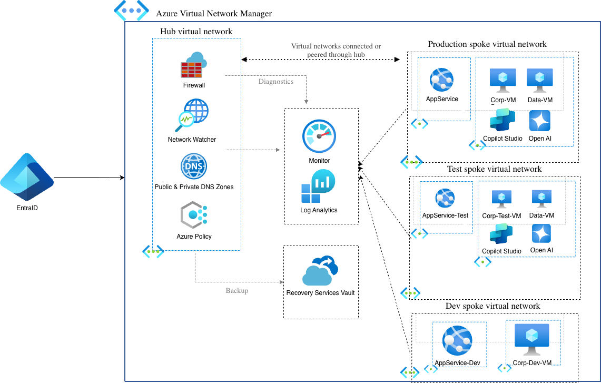

## Hub-and-Spoke Network Infrastructure

I built this Azure hub-and-spoke network as a portfolio project to demonstrate hands-on infrastructure skills. After managing Azure projects for years as a program manager, I wanted to prove I could design and implement the architecture—not just coordinate the teams building it.

---

## What This Is

A production-style network topology with one central hub and three isolated workload environments—the kind of setup you’d expect at a mid-to-large organization running Azure.

