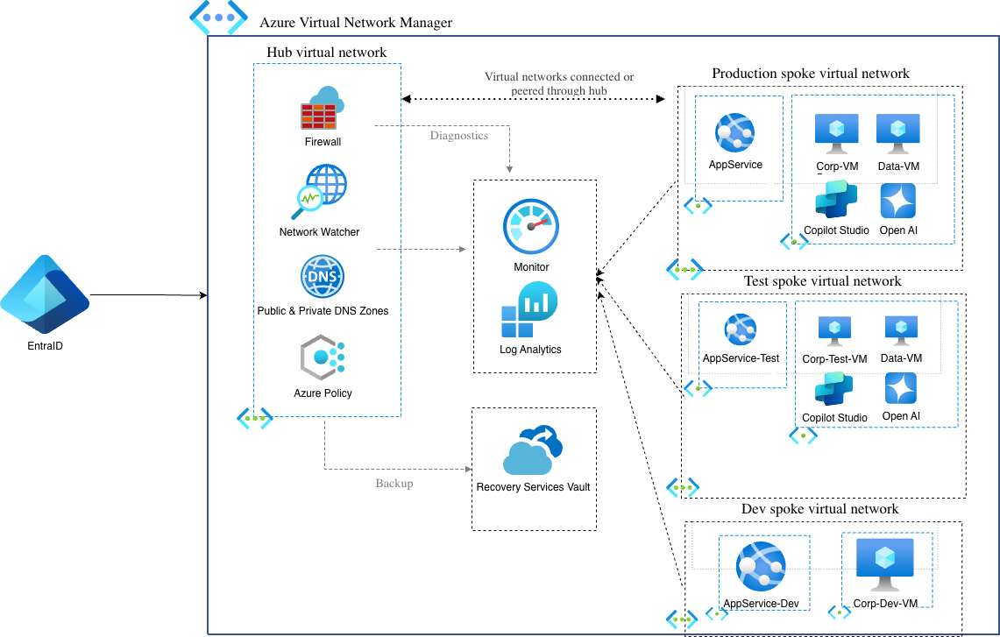

# Azure Hub-and-Spoke Network Platform

I'm a **Senior Program Manager** transitioning into **Azure Infrastructure Engineering**. 
I've spent years managing Azure projects — coordinating the teams, tracking the milestones, 
managing the risks. This project is my way of proving I can actually build the thing, 
not just manage it.

Everything here is built from scratch using Bicep, deployed via PowerShell, and 
documented as I go.

---

## The Business Problem

A professional services firm with 1,000 employees is moving workloads to Azure. They 
have three very different environments that need to coexist securely:

**Customer-facing web application**
A client portal used by 5,000+ external customers to access project updates, documents, 
and billing. It needs to be internet-accessible, highly available, and protected from 
attacks.

**Internal employee intranet**
SharePoint, HR systems, file shares — the stuff all 1,000 employees use every day. 
This should never be directly exposed to the internet but needs connectivity back to 
on-premises systems.

**AI experimentation environment**
The data science team is building ML models on sensitive client data. This needs strict 
isolation — a misconfiguration here could expose data or run up a massive compute bill.

The challenge: these workloads need to coexist in Azure without being able to compromise 
each other.

---

## The Architecture

Hub-and-spoke was the right answer. One central hub hosts shared services. Three isolated 
spokes host the workloads. All traffic between spokes routes through the hub for 
inspection and control.
```


**Why not one big VNet?**
A breach in the web application could pivot straight to HR data or AI training sets. 
Not acceptable.

**Why not three isolated VNets?**
No way to share services, centralize monitoring, or run a single VPN gateway. Costs 
triple and operations get complicated.

**Hub-and-spoke gives you both** — workload isolation and centralized shared services.

---

## What's Built

| Component | Status | Details |
|-----------|--------|---------|
| Naming convention | ✅ | Consistent across all resources |
| VNet module | ✅ | Reusable, deployed 4x |
| Hub stack | ✅ | 4 subnets, shared services foundation |
| Spoke stacks | ✅ | 3 spokes, each with its own param file |
| VNet peering | ✅ | Bidirectional, confirmed Connected in portal |
| NSGs | ✅ | Conditional deployment, least-privilege rules |
| Connectivity testing | ✅ | Test VMs deployed, peering validated |
| CI/CD pipelines | 🔲 | GitHub Actions — up next |
| Bastion | 🔲 | Secure VM access without public IPs |
| Firewall | 🔲 | Centralized traffic inspection (budget permitting) |


Modules are the building blocks. Stacks are the orchestration. Parameter files are 
what make each environment unique. One `vnet.bicep` module deployed four times — 
no duplicated code.

---

## Key Design Decisions

**One template, three spokes**
The same `spokes/main.bicep` deploys all three spokes using different parameter files. 
This supports independent team ownership — the web team deploys spoke1, IT deploys 
spoke2, data science deploys spoke3. Adding a fourth spoke means writing a new param 
file, not touching the template.

**Peering lives in the spoke deployment**
Both directions of peering (spoke→hub and hub→spoke) are created when a spoke is 
deployed. This means you can't deploy a spoke and forget to peer it — the peering 
is automatic.

**NSGs are data-driven**
Each spoke has different subnets so I couldn't just create all NSGs every time. The 
template uses Bicep's `filter()` function to check whether a subnet exists before 
creating or attaching its NSG. No orphaned resources, no hardcoded spoke names.

**One subscription for the lab**
In a real enterprise setup this would be three subscriptions — Dev, Test, and Prod — 
for isolated billing, cleaner RBAC, and blast-radius containment. For this lab, one 
subscription with environment differentiation in the naming convention is the right 
tradeoff.

---

## How to Deploy

**1. Deploy the hub first:**
```powershell
New-AzSubscriptionDeployment `
  -Name hub-deployment `
  -Location eastus `
  -TemplateFile ./infra/stacks/hub/main.bicep `
  -TemplateParameterFile ./infra/stacks/hub/hub.bicepparam
```

**2. Deploy each spoke:**
```powershell
New-AzSubscriptionDeployment `
  -Name spoke1-deployment `
  -Location eastus `
  -TemplateFile ./infra/stacks/spokes/main.bicep `
  -TemplateParameterFile ./infra/stacks/spokes/spoke1.bicepparam
```

Repeat for `spoke2.bicepparam` and `spoke3.bicepparam`.

---

## Documentation

Go to the Documentation folder for all documentation 

---

## What I Learned

* **Bicep modules are worth the upfront effort.** Writing `vnet.bicep` once and 
  reusing it four times was far cleaner than copy-pasting similar code.
* **Naming matters more than you expect.** During an interview demo, I don't want 
  to guess which environment a resource belongs to.
* **Infrastructure should be boring.** The goal isn't clever code — it's reliable, 
  repeatable deployments that others can understand and extend.
* **Deployment sequence is a real constraint.** You can't peer what doesn't exist 
  yet. Thinking through dependency order before writing code saves a lot of back 
  and forth.
* **`filter()` over `contains()` for object arrays.** Learned this the hard way 
  when trying to write conditional NSG deployment.
* **Private IPs are private.** You can't SSH to a VM from your laptop using its 
  private IP. Need a public IP or Bastion. Learned this the hard way too.

---

## Tools & Technologies

| Tool | How I used it |
|------|--------------|
| Azure Bicep | All infrastructure as code |
| PowerShell (Az module) | Deployments and resource queries |
| GitHub | Version control and portfolio |
| VS Code | Development environment |
| Azure Portal | Validation and troubleshooting |
| Claude AI | Technical advisor — coaches me through problems, doesn't just give me answers |
